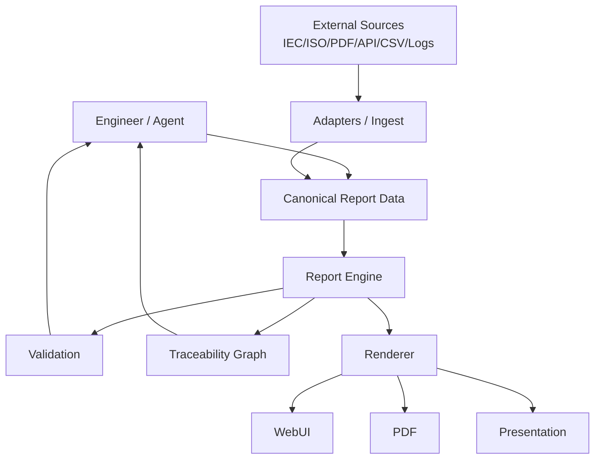
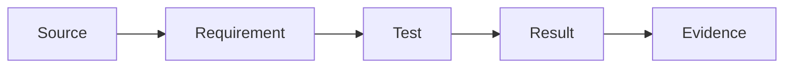
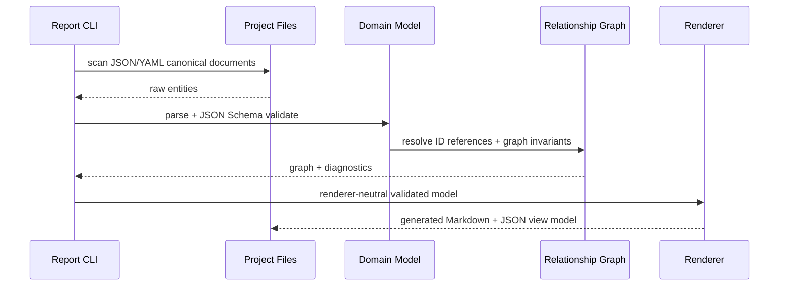
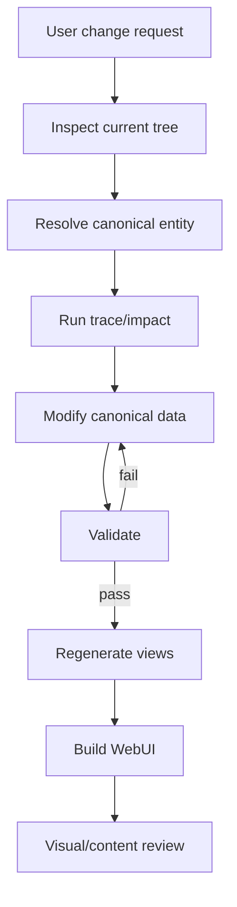

# Architecture

## 1. Scope

Engineering Report Stack is a **report compiler**, not a hand-authored website.

A report project contains canonical engineering entities. The stack validates relationships, computes traceability, and generates one or more presentation views.

## 2. System context



## 3. Dependency direction

```text
Presentation
    ↓
Application / Generator
    ↓
Domain Model
    ↑
Infrastructure / Adapters
```

The domain model must not depend on VitePress, Quarto, Vue, React, a database, or a browser.

## 4. Canonical entities

The core domain uses five primary entity types:

| Entity | Stable ID prefix | Purpose |
|---|---|---|
| Source | `STD-`, `SRC-` | Authoritative source or referenced document |
| Requirement | `REQ-` | Engineering requirement / claim |
| Test | `TEST-` | Verification procedure |
| Result | `RES-` | Verification outcome |
| Evidence | `EVD-` | Image/log/measurement/file supporting a result |

The default trace chain is:



Additional entity types can be added later without coupling them to the renderer.

## 5. Invariants

1. IDs are globally unique inside one report project.
2. Relationships use IDs, not copied titles.
3. Canonical data lives under the report project's `data/` tree.
4. Generated Markdown/HTML must never become the source of truth.
5. A referenced entity must exist.
6. Evidence file paths must resolve when the evidence declares a local file.
7. A change to canonical data must be followed by validation and regeneration.
8. An agent must inspect dependency impact before modifying an existing entity.
9. Citations are modelled as data: source ID + locator, not free-text URLs duplicated across pages.
10. UI components receive view data; they do not embed canonical engineering facts.

## 6. Report project contract

```text
my-report/
├── report.yaml            # report.json is also supported
├── data/
│   ├── sources/
│   ├── requirements/
│   ├── tests/
│   ├── results/
│   └── evidence/
└── evidence/
    ├── images/
    ├── logs/
    └── measurements/
```

Each entity is one JSON or YAML document. File-per-entity keeps diffs small, supports independent additions/removals, and lets teams choose JSON for machine-oriented workflows or YAML for human authoring.

## 7. Read path



## 8. Change path

For an existing report change:



No workflow step should patch generated HTML when the canonical source exists.

## 9. Renderer boundary

VitePress is the v0.1 reference renderer, not the domain architecture.

Future adapters may implement:

```text
Canonical Model
├── VitePressRenderer
├── QuartoRenderer
├── ObservableRenderer
├── EvidenceRenderer
└── SlidevRenderer
```

## 10. v0.2 module boundaries

```text
report_engine/
├── io.py                  # JSON/YAML input adapter
├── model.py               # canonical runtime types only
├── schema_validation.py   # JSON Schema 2020-12 validation
├── graph.py               # relationships, trace and impact semantics
├── validation.py          # validation orchestration + evidence paths
├── cli.py                 # use-case boundary / commands
└── renderers/
    └── vitepress.py       # VitePress Markdown + view-model adapter
```

Dependency direction is intentional: input parsing, schema validation, graph semantics, and rendering are separate responsibilities. Vue components consume the generated view model and never become canonical data owners.

## 11. Long-term design constraints

- Prefer deterministic scripts over agent-written repetitive transformations.
- Keep schemas backward compatible or version them explicitly.
- Keep upstream framework integration behind adapters.
- Avoid importing/forking large upstream repositories into this repo.
- Reference upstream projects by URL/version/license and consume them as dependencies.
- Maintain tests around graph semantics before adding complex UI.
