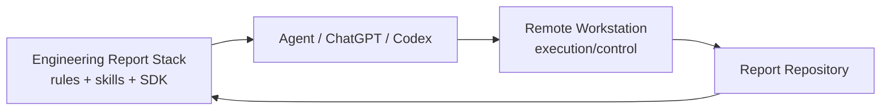

# Plugin and Skill Usage

Engineering Report Stack is packaged as a **skill-first Codex plugin** and a reusable Report-as-Code SDK.

## Plugin manifest

The repository contains:

```text
.codex-plugin/plugin.json
skills/
prompts/
```

The plugin owns report-domain knowledge. Remote Workstation remains the execution/control plane.

## Local Codex use

Install or refresh the skills:

```bash
./scripts/install-codex-skills.sh --force
```

They are copied to:

```text
${CODEX_HOME:-~/.codex}/skills
```

Restart Codex after installation.

## New ChatGPT conversation

Until Engineering Report Stack is installed as a native ChatGPT plugin/app, use:

```text
prompts/chatgpt-bootstrap.md
```

as the bootstrap instruction in a new conversation.

The bootstrap intentionally contains workflow constraints rather than project-specific report content.

## Primary workflow

`engineering-web-report` orchestrates:

```text
inspect
  -> identify canonical source
  -> trace
  -> impact
  -> modify canonical data/component
  -> schema + semantic validation
  -> generate view model
  -> build
  -> review
```

Specialized skills cover architecture, data modelling, diagrams, citations, evidence, and final review.

## Runtime relationship



Do not couple report-domain logic into Remote Workstation itself.
