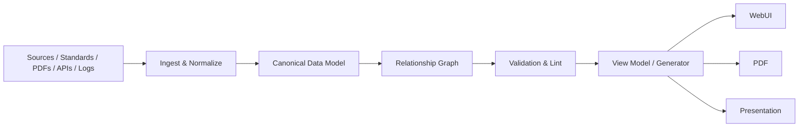

# Engineering Report Stack

**Report-as-Code for engineering teams.**

Engineering Report Stack turns traceable engineering data into maintainable WebUI reports. It separates canonical data from presentation so standards, requirements, tests, evidence, results, diagrams, and citations can be changed once and rendered consistently everywhere.

## Core principles

- **One fact, one canonical source.**
- **Stable IDs over copied text.**
- **Explicit input/output relationships.**
- **Generated views are read-only.**
- **Every claim is traceable to a source, test, or evidence item.**
- **Every report change runs impact analysis before implementation.**
- **Architecture and data flow come before UI edits.**

## Architecture



The WebUI is a projection of canonical engineering data, not the place where engineering facts are authored.

## Repository layout

```text
Engineering-Report-Stack/
├── .codex-plugin/         # Codex/OpenAI plugin manifest
├── skills/                # Portable Agent Skills
├── schemas/               # Canonical JSON Schema contracts
├── references/            # Framework catalogue and engineering rules
├── tools/                 # Deterministic CLI: validate/trace/impact/generate
├── examples/              # Working report examples
├── web/                   # VitePress report shell
├── ARCHITECTURE.md
├── AGENTS.md
└── package.json
```

## Quick start

Requirements: Node.js 18+ and Python 3.10+.

```bash
git clone https://github.com/Tunglam0605/Engineering-Report-Stack.git
cd Engineering-Report-Stack

npm install
npm run report:check
npm run report:generate
npm run docs:dev
```

The demo report uses:

```text
Source
  └─ Requirement
      └─ Test
          └─ Result
              └─ Evidence
```

Create a new report project:

```bash
python3 tools/new_report.py ../My-Engineering-Report \
  --id RPT-MY-PROJECT \
  --name "My Engineering Report"
```

Useful commands:

```bash
python3 tools/report_cli.py validate examples/demo-report
python3 tools/report_cli.py trace examples/demo-report REQ-EMC-001
python3 tools/report_cli.py impact examples/demo-report STD-DEMO-001
python3 tools/report_cli.py generate examples/demo-report web/generated/demo-report.md
```

## Renderer strategy

The core data model is renderer-independent. The initial reference WebUI uses **VitePress + Mermaid** because it is lightweight, Markdown-native, Vue-extensible, and easy to deploy. Other engines are documented under `references/framework-catalog.md`:

- Quarto — technical/scientific publication, citations and cross-references.
- Observable Framework — data-heavy interactive reports and dashboards.
- Evidence — SQL/data reporting as code.
- Docusaurus — larger versioned documentation portals.
- Slidev / reveal.js — presentation output.
- Mermaid — diagram-as-code.

## Agent/plugin usage

This repository is also a skill-first Codex plugin. The primary skill is `engineering-web-report`; specialized skills cover architecture, data modelling, diagrams, citations, evidence, and review.

The OpenAI plugin manifest is in `.codex-plugin/plugin.json`.

## Status

**v0.1 bootstrap:** canonical model, relationship validation, trace/impact CLI, VitePress shell, Mermaid diagrams, Agent Skills, and a working demo.

See [ARCHITECTURE.md](ARCHITECTURE.md) and [ROADMAP.md](ROADMAP.md).

## License

Apache-2.0.
