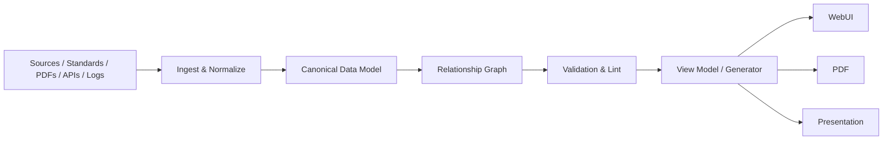

# Engineering Report Stack

**Report-as-Code for engineering teams.**

Engineering Report Stack turns traceable engineering data into maintainable WebUI reports. It separates canonical data from presentation so standards, requirements, tests, evidence, results, diagrams, and citations can be changed once and rendered consistently everywhere.

## Core principles

- **One fact, one canonical source.**
- **Stable IDs over copied text.**
- **Explicit input/output relationships.**
- **Generated views are read-only.**
- **Every claim is traceable to a source, test, or evidence item.**
- **Every report change runs impact analysis before implementation.**
- **Architecture and data flow come before UI edits.**

## Architecture



The WebUI is a projection of canonical engineering data, not the place where engineering facts are authored.

## Repository layout

```text
Engineering-Report-Stack/
├── .codex-plugin/         # Codex/OpenAI plugin manifest
├── report_engine/         # SRP core: IO, schema, graph, validation, renderers
├── skills/                # Portable Agent Skills
├── schemas/               # JSON Schema 2020-12 contracts
├── templates/             # compliance / validation / test / handoff profiles
├── prompts/               # ChatGPT bootstrap and migration/review prompts
├── references/            # Framework catalogue and engineering rules
├── tools/                 # Thin CLI + report scaffolder
├── examples/              # Working report examples
├── tests/                 # Core / schema / graph / skill integration tests
├── web/                   # VitePress + reusable Vue components
├── ARCHITECTURE.md
├── AGENTS.md
└── package.json
```

## Quick start

Requirements: Node.js 18+ and Python 3.10+.

```bash
git clone https://github.com/Tunglam0605/Engineering-Report-Stack.git
cd Engineering-Report-Stack

./scripts/bootstrap.sh
npm run docs:dev
```

`bootstrap.sh` creates a local `.venv`, installs the Python SDK and JSON Schema/YAML dependencies, installs WebUI dependencies, runs tests, validates the demo, and builds the site.

The demo report uses:

```text
Source
  └─ Requirement
      └─ Test
          └─ Result
              └─ Evidence
```

Create a new report project (YAML is the default authoring format):

```bash
.venv/bin/python tools/new_report.py ../My-Engineering-Report \
  --id RPT-MY-PROJECT \
  --name "My Engineering Report" \
  --template compliance
```

Templates: `compliance`, `validation`, `test`, `handoff`.

Useful commands:

```bash
npm run report:inspect
npm run report:check
npm run report:trace
npm run report:impact
npm run report:generate
npm run docs:build
```

The generator emits both Markdown and a renderer-facing JSON view model. The WebUI provides reusable summary, status, evidence and searchable entity components without moving canonical engineering facts into Vue code.

## Renderer strategy

The core data model is renderer-independent. The initial reference WebUI uses **VitePress + Mermaid** because it is lightweight, Markdown-native, Vue-extensible, and easy to deploy. Other engines are documented under `references/framework-catalog.md`:

- Quarto — technical/scientific publication, citations and cross-references.
- Observable Framework — data-heavy interactive reports and dashboards.
- Evidence — SQL/data reporting as code.
- Docusaurus — larger versioned documentation portals.
- Slidev / reveal.js — presentation output.
- Mermaid — diagram-as-code.

## Agent/plugin usage

This repository is also a skill-first Codex plugin. The primary skill is `engineering-web-report`; specialized skills cover architecture, data modelling, diagrams, citations, evidence, and review.

The OpenAI plugin manifest is in `.codex-plugin/plugin.json`.

## Status

**v0.2 Engineering Report SDK:** JSON/YAML canonical authoring, JSON Schema validation, SRP core package, trace/impact/inspect tooling, interactive VitePress components, generated view model, report templates, CI and Agent Skills are operational.

For a new ChatGPT conversation, use `prompts/chatgpt-bootstrap.md` until the repository is distributed as a native ChatGPT plugin/app.

See [ARCHITECTURE.md](ARCHITECTURE.md) and [ROADMAP.md](ROADMAP.md).

## License

Apache-2.0.
