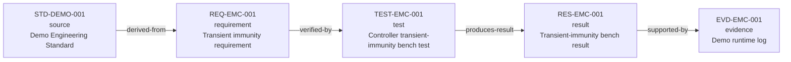
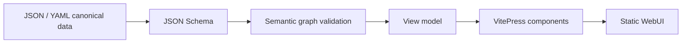

# Engineering Report Stack Demo

Minimal traceable report demonstrating one source-to-evidence engineering chain.

**Report ID:** `RPT-DEMO-001`  
**Version:** `0.1.0`

## Report overview

<ReportSummary data-url="./demo-report.json" />

## Explore canonical entities

<EntityExplorer data-url="./demo-report.json" />

## Traceability graph

## Sources

| ID | Title | Type | Edition | Source |
|---|---|---|---|---|
| `STD-DEMO-001` | Demo Engineering Standard | standard | 1.0 | [open](https://github.com/Tunglam0605/Engineering-Report-Stack) |

## Requirements

| ID | Requirement | Status | Source locator | Acceptance |
|---|---|---|---|---|
| `REQ-EMC-001` | **Transient immunity requirement** — The controller shall remain operational during the defined transient-immunity verification scenario. | proposed | STD-DEMO-001 · page 1 · section Demo clause | No reset, unsafe output, or loss of required communication during the test window. |

## Verification tests

| ID | Test | Verifies | Status | Acceptance criteria |
|---|---|---|---|---|
| `TEST-EMC-001` | Controller transient-immunity bench test | `REQ-EMC-001` | completed | No reset, unsafe output, or persistent communication loss. |

## Results

| Result | Test | Status | Summary | Evidence |
|---|---|---|---|---|
| `RES-EMC-001` | `TEST-EMC-001` | pass | The demo controller state remained operational and the monitored communication state recovered without manual intervention. | `EVD-EMC-001` |

## Evidence catalogue

<EvidenceCard title="Demo runtime log" evidence-id="EVD-EMC-001" type="log" test-id="TEST-EMC-001" result-id="RES-EMC-001" locator="evidence/demo-runtime-log.txt">

Illustrative evidence artifact used to verify end-to-end report traceability.

</EvidenceCard>

## Generation flow

> This page is generated. Edit canonical report data, then regenerate.
