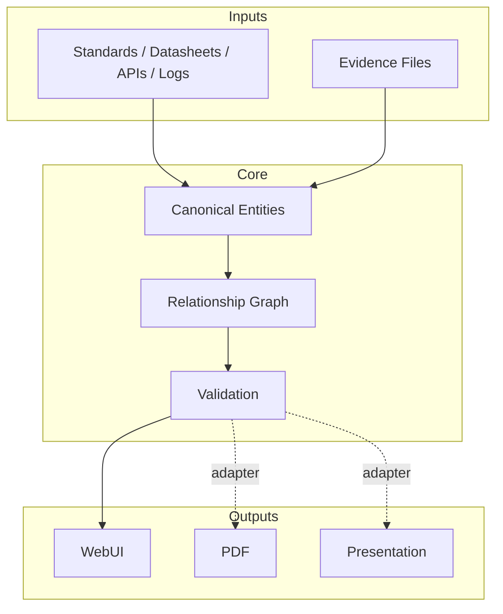
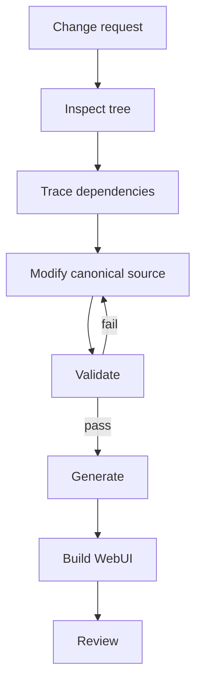

# Architecture

Engineering Report Stack separates **engineering facts** from **presentation**.



## Dependency contract

```text
source -> requirement -> test -> result -> evidence
```

The CLI exposes this contract through:

```bash
python3 tools/report_cli.py trace examples/demo-report REQ-EMC-001
python3 tools/report_cli.py impact examples/demo-report STD-DEMO-001
```

## Change workflow



For the full design contract, see `ARCHITECTURE.md` in the repository root.
