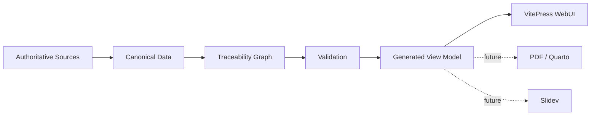

## Data flow



## Start locally

```bash
./scripts/bootstrap.sh
npm run report:inspect
npm run docs:dev
```

The generated report is deliberately not the canonical source. Edit the data under a report project's `data/` tree and regenerate.
